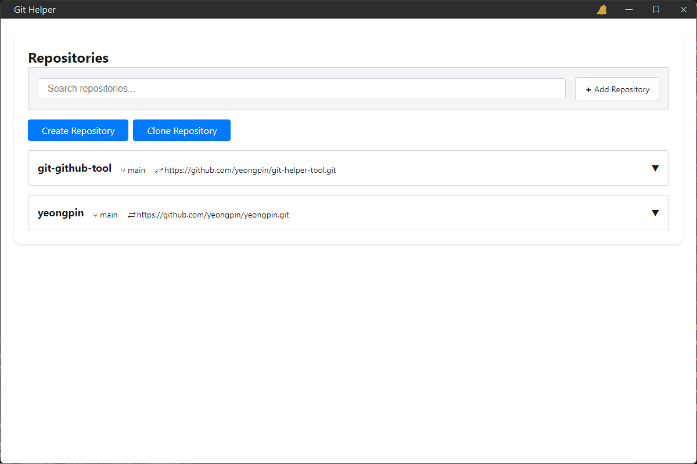
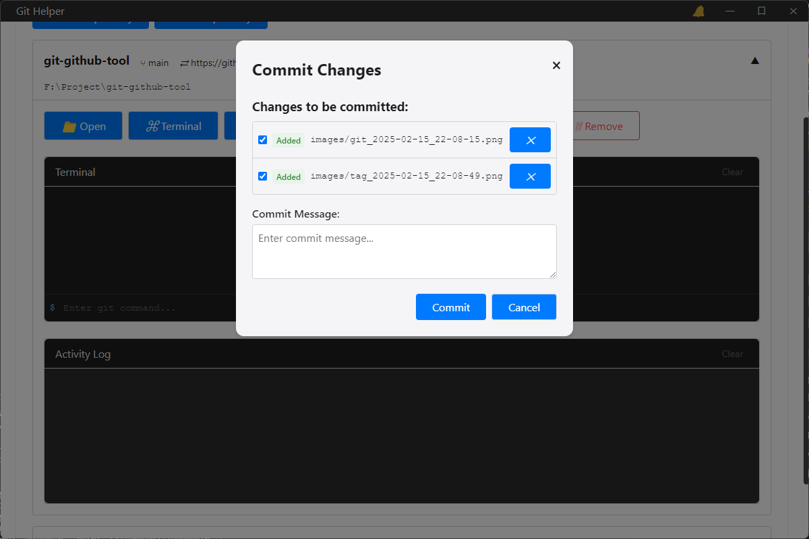
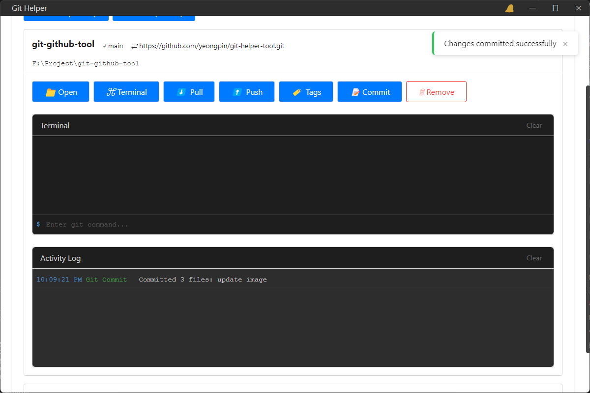
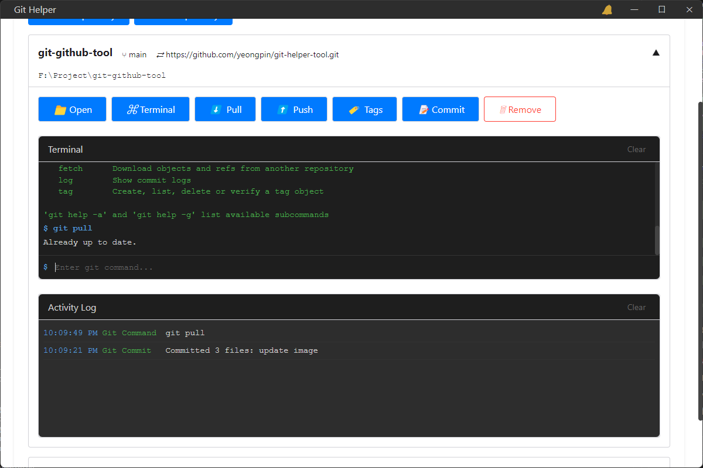
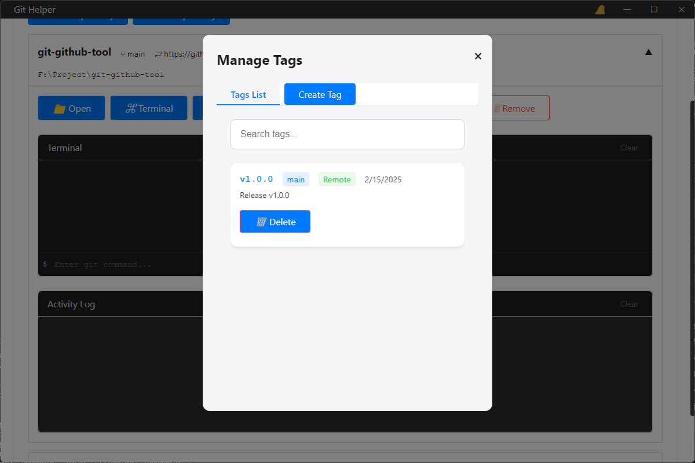

# 🚀 Git Helper

A sophisticated desktop application that streamlines Git operations through an elegant and intuitive interface. This tool empowers developers to manage their Git repositories efficiently without memorizing complex command-line syntax.

<p align="center">
  
</p>

## ✨ Key Features

<details>
<summary> Preview </summary>

<p align="center">
  
  
  
  
  
  
</p>
</details>

## 📦 Repository Management
- 🔄 Seamless integration of local Git repositories
- ⚡ Intuitive repository creation workflow
- 🌐 Efficient remote repository cloning
- 🗑️ Smart repository removal (preserves local files)

## 🛠️ Core Operations
- 📊 Real-time repository status monitoring
- 💫 Streamlined commit workflow
- 🔄 Automated push/pull synchronization
- 🌿 Advanced branch management
- 🏷️ Comprehensive tag operations

## 🎯 Advanced Features
- 🔍 Real-time repository state monitoring
- 💻 Integrated Git terminal
- 📝 Detailed operation logging
- 🔔 Smart notification system
- 🔧 Intelligent conflict resolution
- ⌨️ Custom Git command execution

## 🔧 Technology Stack
- ⚛️ Electron (Cross-platform desktop framework)
- 💚 Node.js (Runtime environment)
- 🔗 Simple-git (Git integration)
- 🌟 Modern ES6+ JavaScript
- 🎨 Custom-built UI components

## 🚀 Development Setup

1. 📥 Clone Repository
```
git clone https://github.com/yeongpin/git-helper.git
cd git-helper
```

2. 📦 Install Dependencies
```
npm install
```

3. 🔥 Launch Development Server
```
npm start
```

## 🏗️ Production Build
```
npm run build
```

## 🏛️ Architecture

The application follows a modular architecture with clear separation of concerns:
- 🎯 Main Process: Handles system-level operations and Git commands
- 🖥️ Renderer Process: Manages the user interface and event handling
- 🌉 IPC Bridge: Facilitates secure communication between processes
- 🔧 Service Layer: Abstracts Git operations and file system interactions

## 🤝 Contributing

We welcome contributions! Please follow these steps:
1. 🍴 Fork the repository
2. 🌿 Create a feature branch
3. 💾 Commit your changes
4. 🚀 Push to your fork
5. 📬 Submit a Pull Request

## 📜 License

MIT License - Feel free to use this project for both personal and commercial purposes.

## 💡 Support

For issues, feature requests, or questions:
- 🐛 Create an issue in the GitHub repository
- 👥 Join our developer community
- 📚 Check the documentation

---
Built with ❤️ for developers who value efficiency and elegance.

## 🌟 Features Coming Soon
- 🔐 SSH Key Management
- 🔄 Advanced Merge Conflict Resolution
- 📊 Repository Statistics Dashboard
- 🌍 Multi-language Support
- 🎨 Customizable Themes

## 🏆 Why Choose Git Helper?
- 🎯 Intuitive Interface
- ⚡ Lightning Fast Performance
- 🛡️ Secure Operations
- 🔧 Powerful Features
- 💪 Reliable & Stable 

## 📋 Changelog

[See our detailed changelog](CHANGELOG.md) for a complete history of changes.